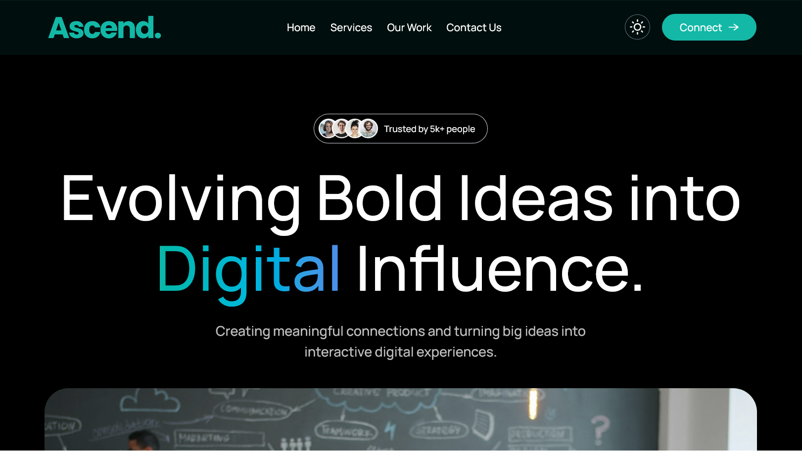

# Ascend | Marketing Agency

A modern, fully responsive web application with dark mode built with **React**, **TailwindCSS** & **Framer Motion**, designed to provide an immersive digital experience for a marketing agency.



## Live Demo

**Check out the live version of this project here:** https://ascendagency.netlify.app/

## Features

- **React Architecture:** Leverages a component-based structure to ensure high performance, maintainability, and a seamless single-page application (SPA) experience.
- **Tailwind CSS:** Utilizes a utility-first CSS framework to rapidly build custom user interfaces directly in markup, ensuring a consistent design system without leaving your HTML.
- **Framer Motion:** Integrates an advanced motion API to handle complex transitions, layout animations, and gesture recognition, ensuring smooth and polished UI interactions.
- **Web3Forms:** Facilitates secure and reliable form handling through a client-side API, ensuring instant notifications and a streamlined communication channel for users.
- **Custom Cursor:** Features a dynamic, interactive cursor design that responds to user input and hover states, providing a unique and immersive navigational experience.
- **Dark Mode:** Features a dynamic theme-switching system that respects user preferences and enhances readability in low-light environments using a centralized state or system-level detection.
- **React Hot Toast:** Features a dynamic notification system that respects user preferences and enhances readability through lightweight, customizable alerts that integrate seamlessly with React's component lifecycle.

## Tech Stack

- **Frontend:** React.js
- **Build Tool:** Vite
- **Styling:** Tailwind CSS
- **Animations:** Framer Motion
- **Form Handling:** Web3Forms

## Getting Started

Follow these steps to get a local copy up and running:

### Prerequisites

- **Node.js**
- **npm** or **yarn**

### Installation

1. **Clone the repository:**

```bash
git clone https://github.com/avicious/agency.git
```

2. **Navigate to the project directory:**

```bash
cd agency
```

3. **Install dependencies:**

```bash
npm install
```

4. **Start the development server:**

```bash
npm run dev
```
